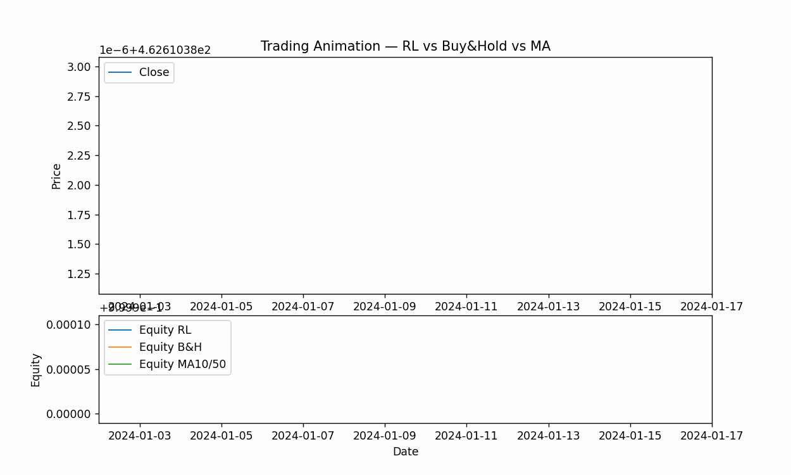
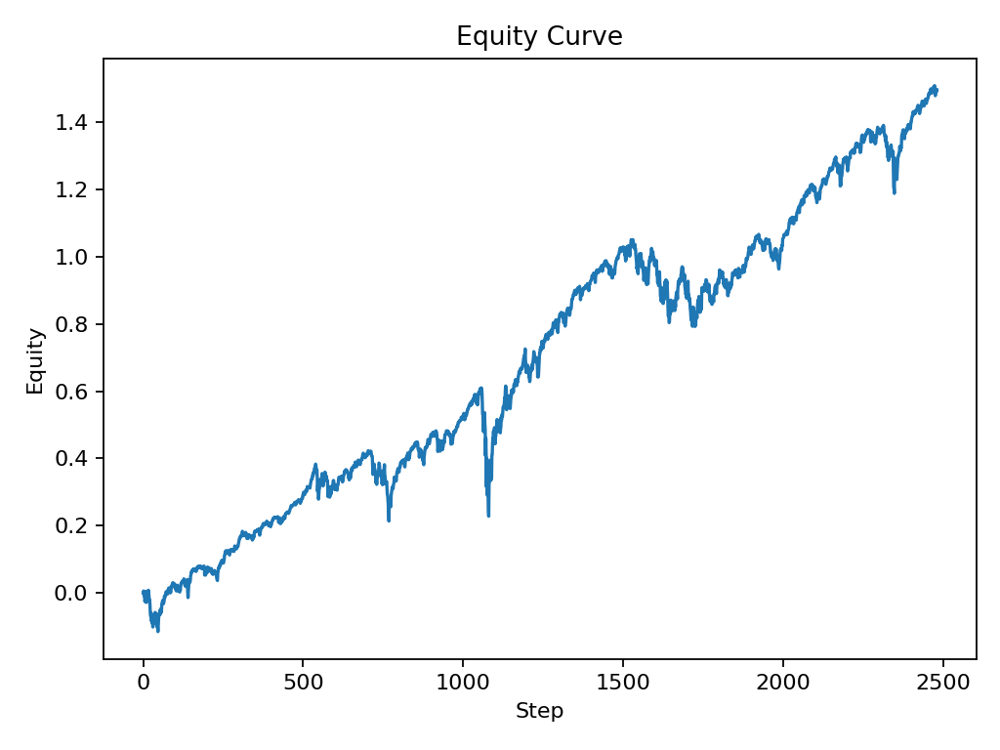
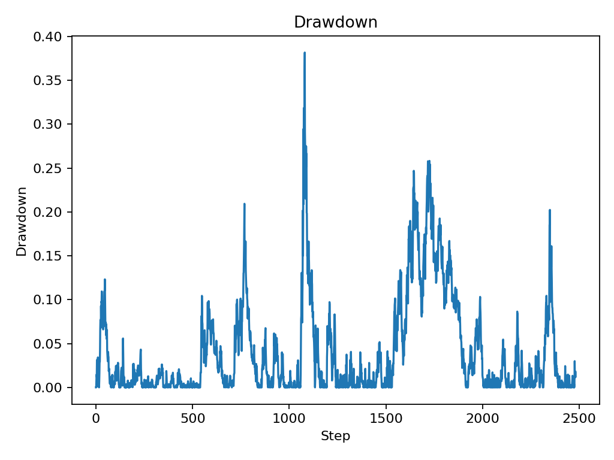
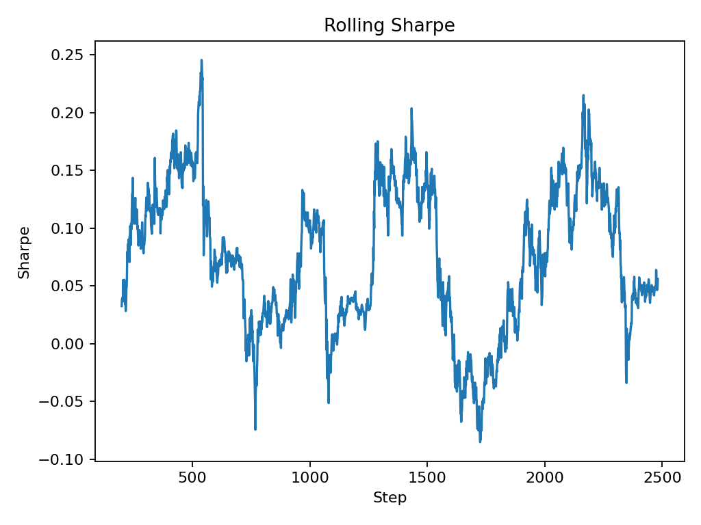
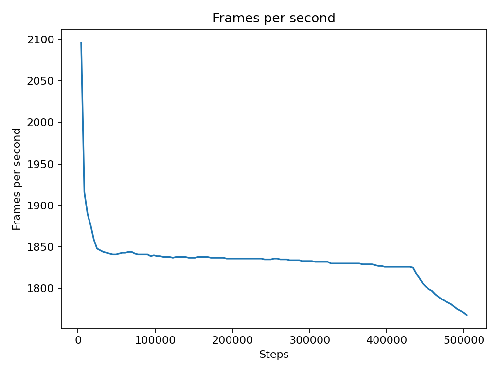
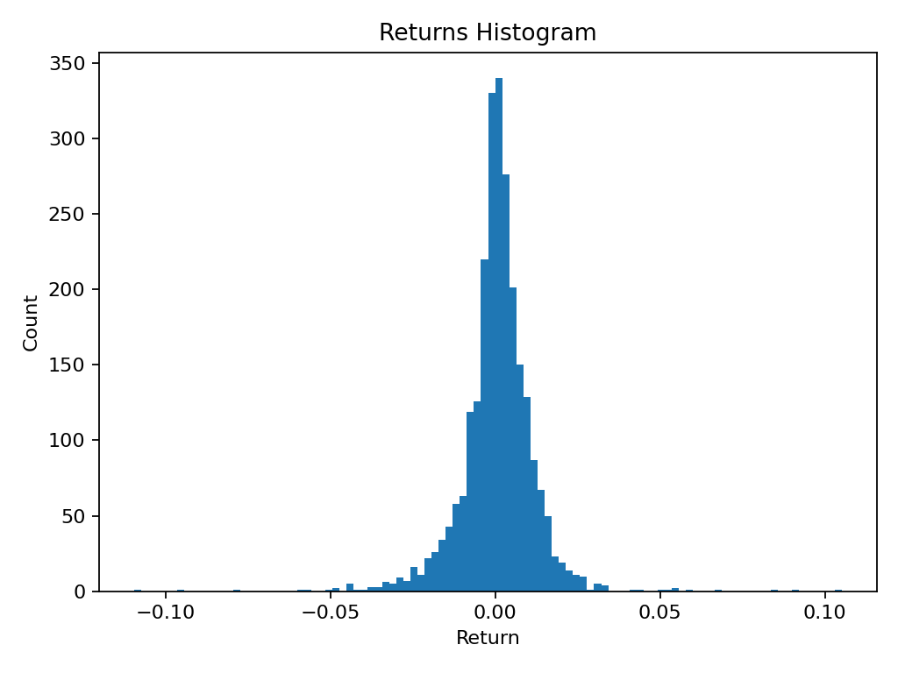
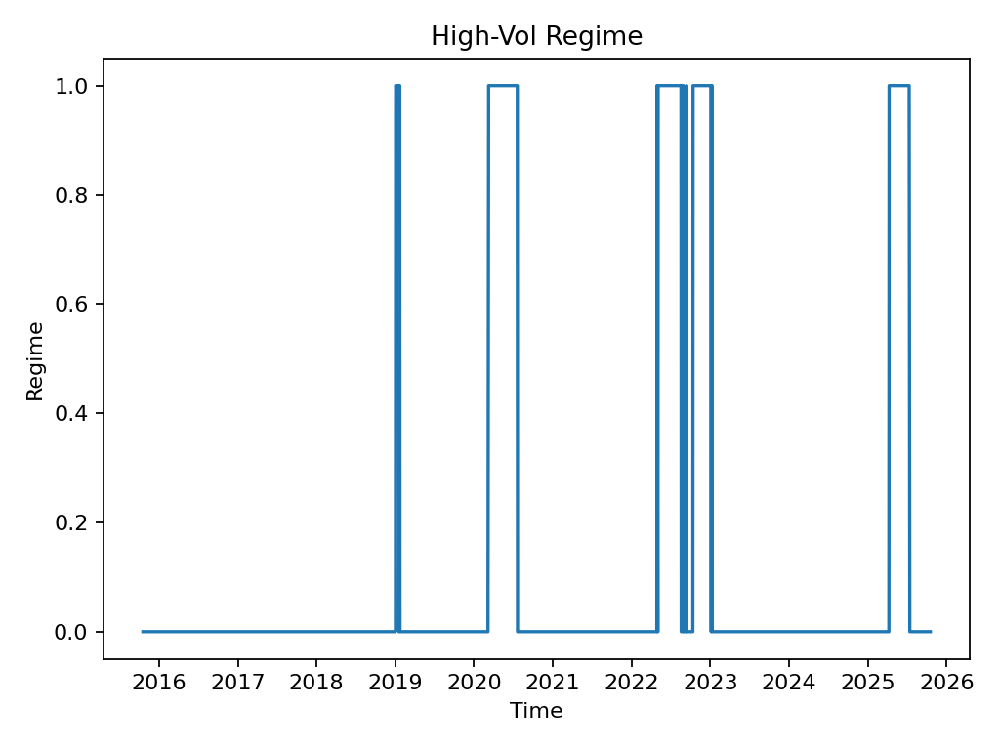
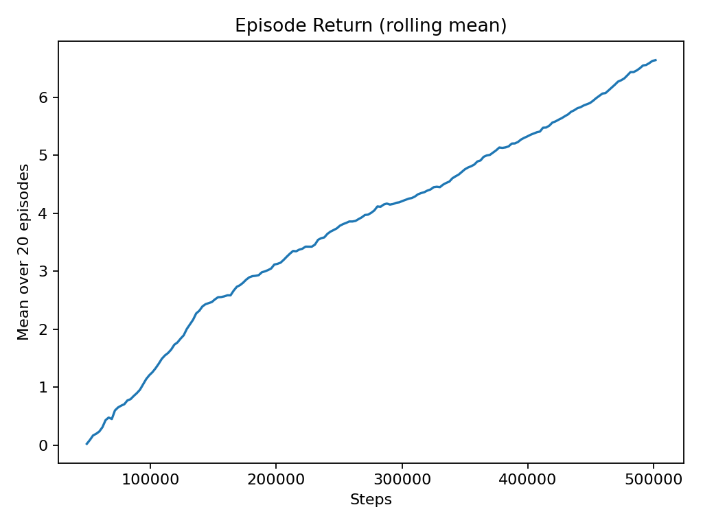

# Quant-RL Lab

High-performance reinforcement learning for systematic trading.  
This repo pairs a fast **C++ market simulator/backtester** with **Python RL agents** (Stable-Baselines3/PyTorch) and classic technical baselines for walk-forward evaluation on daily SPY data.

> Research code for education only — **not financial advice**.

---

## Highlights

- **Walk-forward evaluation (WFV)** with year-by-year folds (train → validate → test)  
- **C++ backtester core** (pybind11) for speed; Python for agents & orchestration  
- **Baselines:** moving-average crossover (fast/slow), short-on-bear flag, fee/slippage modeling  
- **RL agents:** PPO (plug in other Stable Baseline 3 algorithms easily)  
- **Reports:** Sharpe, Max Drawdown, equity curves, trade stats, and optional animation  

**Recent results (example run)**  
- PPO on SPY (2005–2024), 3-fold walk-forward: **Sharpe 0.8868 ± 0.1022**, **MaxDD 0.0818**  
- Speed benchmark: **≈ 171 k steps/s** for 1 M-step runs; micro-loop **≈ 1.36 M steps/s**

---

## Results & Figures

  

### Performance Overview
<table>
  <tr>
    <td> <b>Equity:</b> Cumulative portfolio value</td>
    <td> <b>Drawdown:</b> Peak-to-trough losses</td>
  </tr>
  <tr>
    <td> <b>Rolling Sharpe:</b> Stability of risk-adjusted returns</td>
    <td> <b>Speed:</b> Simulator throughput (steps/s)</td>
  </tr>
</table>

### Data Sanity & Market Context
<table>
  <tr>
    <td> <b>Returns Histogram:</b> Fat tails vs normal</td>
    <td> <b>Regime:</b> Simple bull/bear labeling used by baselines</td>
  </tr>
</table>

### Training Dynamics

  

---

